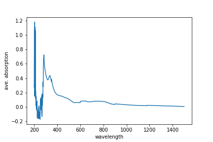
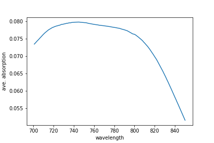
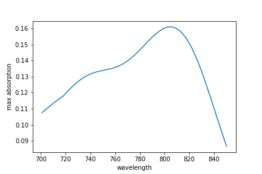
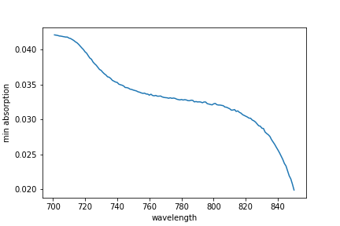

## Visualizing data
The mathematician Richard Hamming once said, "The purpose of computing is insight, not numbers," and
the best way to develop insight is often to visualize data.  Visualization deserves an entire
lecture of its own, but we can explore a few features of Python's `matplotlib` library here.  While
there is no official plotting library, `matplotlib` is the _de facto_ standard.  Let's import it - 

~~~
import matplotlib.pyplot
~~~
{: .language-python}

> ## Some IPython Magic
>
> If you're using an IPython / Jupyter notebook,
> you'll need to execute the following command
> in order for your matplotlib images to appear
> in the notebook when `show()` is called:
>
> ~~~
> %matplotlib inline
> ~~~
> {: .language-python}
>
> The `%` indicates an IPython magic function -
> a function that is only valid within the notebook environment.
> Note that you only have to execute this function once per notebook.
{: .callout}

Let's take a look at the average absorption data across all wavelengths:

~~~
ave_absorption = numpy.mean(data, axis=0)
ave_plot = matplotlib.pyplot.plot(ave_absorption)
matplotlib.pyplot.show()
~~~
{: .language-python}

Here, we have put the average per wavelength across all samples in the variable `ave_absorption`, then
asked `matplotlib.pyplot` to create and display a line graph of those values.

At the moment the x-axis has no physical significance; it is an integer range from 0 to 1200. 
It would be better if the x-axis corresponded to the wavelength.
Let's read in the wavelength from the original (un-cleaned) data file

~~~
wavelengths_df = pandas.read_csv("./data/UVVis-01.csv",usecols=[0],header=None)
~~~
{: .language-python}

We read in the first column of the data file as this contains the wavelength data. 
This has created a `DataFrame` object with a single column.
We can convert this to a `NumPy` array using the DataFrame `to_numpy` method

~~~
wavelengths = wavelengths_df.to_numpy()
~~~
{: .language-python}

We can now ask `matplotlib.pyplot` to plot a line graph of absorption vs wavelength with labelled axes.

~~~
ave_plot = matplotlib.pyplot.plot(wavelengths,ave_absorption)
matplotlib.pyplot.xlabel("wavelength")
matplotlib.pyplot.ylabel("ave. absorption")
matplotlib.pyplot.show()
~~~

We are interested in analysing a sub-set of the data, from index 650 to index 800. 
So let's take a slice of the wavelength and data arrays.

~~~
data_slice = data[:,650:800]
wavelength_slice = wavelengths[650:800]
~~~
{: .language-python} 

We can now plot this sub-set of the absorption data.

~~~
max_plot = matplotlib.pyplot.plot(wavelength_slice,numpy.mean(data_slice, axis=0))
matplotlib.pyplot.xlabel("wavelength")
matplotlib.pyplot.ylabel("ave. absorption")
matplotlib.pyplot.show()
~~~
{: .language-python}

Let's have a look at two other statistics:

~~~
max_plot = matplotlib.pyplot.plot(wavelength_slice,numpy.max(data_slice, axis=0))
matplotlib.pyplot.xlabel("wavelength")
matplotlib.pyplot.ylabel("max absorption")
matplotlib.pyplot.show()
~~~
{: .language-python}

~~~
min_plot = matplotlib.pyplot.plot(wavelength_slice,numpy.min(data_slice, axis=0))
matplotlib.pyplot.xlabel("wavelength")
matplotlib.pyplot.ylabel("min absorption")
matplotlib.pyplot.show()
~~~
{: .language-python}

### Grouping plots
You can group similar plots in a single figure using subplots.
This script below uses a number of new commands. The function `matplotlib.pyplot.figure()`
creates a space into which we will place all of our plots. The parameter `figsize`
tells Python how big to make this space. Each subplot is placed into the figure using
its `add_subplot` [method]({{ page.root }}/reference/#method). The `add_subplot` method takes 3
parameters. The first denotes how many total rows of subplots there are, the second parameter
refers to the total number of subplot columns, and the final parameter denotes which subplot
your variable is referencing (left-to-right, top-to-bottom). Each subplot is stored in a
different variable (`axes1`, `axes2`, `axes3`). Once a subplot is created, the axes can
be titled using the `set_xlabel()` command (or `set_ylabel()`).
Here are our three plots side by side:

~~~
import numpy
import pandas
import matplotlib.pyplot

data = numpy.loadtxt(fname='./data/UVVis-01-cleaned.csv', delimiter=',')
wavelengths = pandas.read_csv("./data/UVVis-01.csv",usecols=[0],header=None).to_numpy()

data_slice = data[:,650:800]
wavelength_slice = wavelengths[650:800]

fig = matplotlib.pyplot.figure(figsize=(10.0, 3.0))

axes1 = fig.add_subplot(1, 3, 1)
axes2 = fig.add_subplot(1, 3, 2)
axes3 = fig.add_subplot(1, 3, 3)

axes1.set_ylabel('average')
axes1.set_xlabel('wavelength')
axes1.plot(wavelength_slice,numpy.mean(data_slice, axis=0))

axes2.set_ylabel('max')
axes2.set_xlabel('wavelength')
axes2.plot(wavelength_slice,numpy.max(data_slice, axis=0))

axes3.set_ylabel('min')
axes3.set_xlabel('wavelength')
axes3.plot(wavelength_slice,numpy.min(data_slice, axis=0))

fig.tight_layout()

matplotlib.pyplot.savefig('./group_plot.png')

matplotlib.pyplot.show()
~~~
{: .language-python}

The [call]({{ page.root }}/reference/#function-call) to `loadtxt` reads our data,
and the rest of the program tells the plotting library
how large we want the figure to be,
that we're creating three subplots,
what to draw for each one,
and that we want a tight layout
(If we leave out that call to `fig.tight_layout()`,
the graphs will actually be squeezed together more closely).
The [call]({{ page.root }}/reference/#function-call) to `savefig` saves our figure to the file `group_plot.png`.

> ## Scientists Dislike Typing
>
> We will always use the syntax `import numpy` to import NumPy.
> However, in order to save typing, it is
> [often suggested](http://www.scipy.org/getting-started.html#an-example-script)
> to make a shortcut like so: `import numpy as np`.
> If you ever see Python code online using a NumPy function with `np`
> (for example, `np.loadtxt(...)`), it's because they've used this shortcut.
> When working with other people, it is important to agree on a convention of how common libraries
> are imported.
{: .callout}

> ## Line fitting
>
> In the previous chapter we calculated the velocity of a ball and stored it as a Numpy array
> ~~~
> import numpy
>
> g = 6.67408e-11
> velocity_list = numpy.zeros(50)
> v_0 = 0
> 
> for index,time in enumerate(numpy.linspace(0,10,50)):
>        velocity_list[index] = v_0 + g*time
> ~~~
> {: .language-python}
>
> We can fit a polynomial to this data using the `numpy.polyfit` function. In this case, we know that is is a first order polynomial (straight line)
> ~~~
> fit = numpy.polyfit(numpy.linspace(0,10,50), velocity_list, 1)
> print(fit)
> ~~~
> {: .language-python}
> 
> What is the gradient and intercept of the straight line fit? Does this make physical sense? 
> Make a scatter plot of velocity vs time. Label the x-axis and y-axis (with units) and give the plot a title.
>
> > ## Solution
> > The gradient is equal to the acceleration of the ball which is given by the gravitational constant $g$. The intercept is the starting velocity of the ball, which in this example is zero.
> > ~~~
> > import matplotlib.pyplot as plt
> >
> > plt.scatter(numpy.linspace(0,10,50),velocity_list)
> > plt.xlabel("Time (s)")
> > plt.ylabel("Velocity (m/s)")
> > plt.title("Velocity of an object accelerated by gravity")
> > ~~~
> > {: .language-python}
> {: .solution}
>
> Use the polyval function to generate and plot velocities over the timeframe 30 to 100 seconds
> 
> >  ## Solution
> > ~~~
> > import matplotlib.pyplot as plt
> >
> > time_range = numpy.linspace(30,100,70)
> > plt.plot(time_range,np.polyval(fit,time_range))
> > plt.xlabel("Time (s)")
> > plt.ylabel("Velocity (m/s)")
> > plt.title("Velocity of an object accelerated by gravity")
> > ~~~
> > {: .language-python}
> {: .solution}
{: .challenge}

> ## Error bars and exponential growth
> 
> This question is partly modelled on the following blog post: https://towardsdatascience.com/modeling-exponential-growth-49a2b6f22e1f.
> We have the following (hypothetical) data for the growth in Covid cases at a university over a two-week period
> ~~~
> import numpy as np
> day = np.arange(0,14)
> case_numbers = np.array([2,3,4,8,15,32,65,128,253,512,1025,2049,4090,8191,16387])
> ~~~
> {: .language-python}
> 
> An administrator realises that some test results may have been filed a day late or a day early. This makes the error bar on the case numbers +/- 200.
> Using the `matplotlib.pyplot.errorbar` function with the `yerr` keyword argument plot the case number data with error bars. Label your axes and title the plot.
> 
> > ## Solution
> > ~~~
> > import matplotlib.pyplot as plt
> > 
> > plt.errorbar(day,case_numbers,yerr=200)
> > plt.xlabel("Time (days)")
> > plt.ylabel("Case numbers")
> > plt.title("Covid case numbers over time")
> > ~~~
> > {: .language-python}
> {: .solution}
> 
> By taking a logarithm of the data, fit a straight line to the case number data and predict the exponential growth factor. 
> 
> > ## Solution
> > From scanning the blog post we can see that the growth factor is the base of the exponential.
> > Assuming the growth is exponential, to generate a straight-(ish) line we first need to take a logarithm of the case values data.
> > We can then fit a straight line to this to calculate the logarithm of the growth factor. 
> > ~~~
> > log_growth_factor, log_starting_case_number = np.polyfit(day,np.log(case_numbers),1)
> > growth_factor = np.exp(log_growth_factor)
> > ~~~
> > {: .language-python}
> {: .solution}
> 
> From inspecting the data, does the calculated growth factor make sense? 
> 
> > ## Solution
> > The data roughly doubles each day. The calculated growth factor is 1.94, which is reassuringly close to 2. 
> {: .solution}
{: .challenge}

> ## Plot Scaling
>
> Why do all of our plots stop just short of the upper end of our graph?
>
> > ## Solution
> > Because matplotlib normally sets x and y axes limits to the min and max of our data
> > (depending on data range)
> {: .solution}
>
> If we want to change this, we can use the `set_ylim(min, max)` method of each 'axes',
> for example:
>
> ~~~
> axes3.set_ylim(0,6)
> ~~~
> {: .language-python}
>
> Update your plotting code to automatically set a more appropriate scale.
> (Hint: you can make use of the `max` and `min` methods to help.)
>
> > ## Solution
> > ~~~
> > # One method
> > axes3.set_ylabel('min')
> > axes3.plot(numpy.min(data, axis=0))
> > axes3.set_ylim(0,6)
> > ~~~
> > {: .language-python}
> {: .solution}
>
> > ## Solution
> > ~~~
> > # A more automated approach
> > min_data = numpy.min(data, axis=0)
> > axes3.set_ylabel('min')
> > axes3.plot(min_data)
> > axes3.set_ylim(numpy.min(min_data), numpy.max(min_data) * 1.1)
> > ~~~
> > {: .language-python}
> {: .solution}
{: .challenge}

> ## Make Your Own Plot
>
> Create a plot showing the standard deviation (`numpy.std`)
> of the absorption data for each day across all patients.
>
> > ## Solution
> > ~~~
> > std_plot = matplotlib.pyplot.plot(numpy.std(data, axis=0))
> > matplotlib.pyplot.show()
> > ~~~
> > {: .language-python}
> {: .solution}
{: .challenge}

> ## Moving Plots Around
>
> Modify the program to display the three plots on top of one another
> instead of side by side.
>
> > ## Solution
> > ~~~
> > import numpy
> > import matplotlib.pyplot
> >
> > data = numpy.loadtxt(fname='UVVis-01-cleaned.csv', delimiter=',')
> >
> > # change figsize (swap width and height)
> > fig = matplotlib.pyplot.figure(figsize=(3.0, 10.0))
> >
> > # change add_subplot (swap first two parameters)
> > axes1 = fig.add_subplot(3, 1, 1)
> > axes2 = fig.add_subplot(3, 1, 2)
> > axes3 = fig.add_subplot(3, 1, 3)
> >
> > axes1.set_ylabel('average')
> > axes1.plot(numpy.mean(data, axis=0))
> >
> > axes2.set_ylabel('max')
> > axes2.plot(numpy.max(data, axis=0))
> >
> > axes3.set_ylabel('min')
> > axes3.plot(numpy.min(data, axis=0))
> >
> > fig.tight_layout()
> >
> > matplotlib.pyplot.show()
> > ~~~
> > {: .language-python}
> {: .solution}
{: .challenge}
